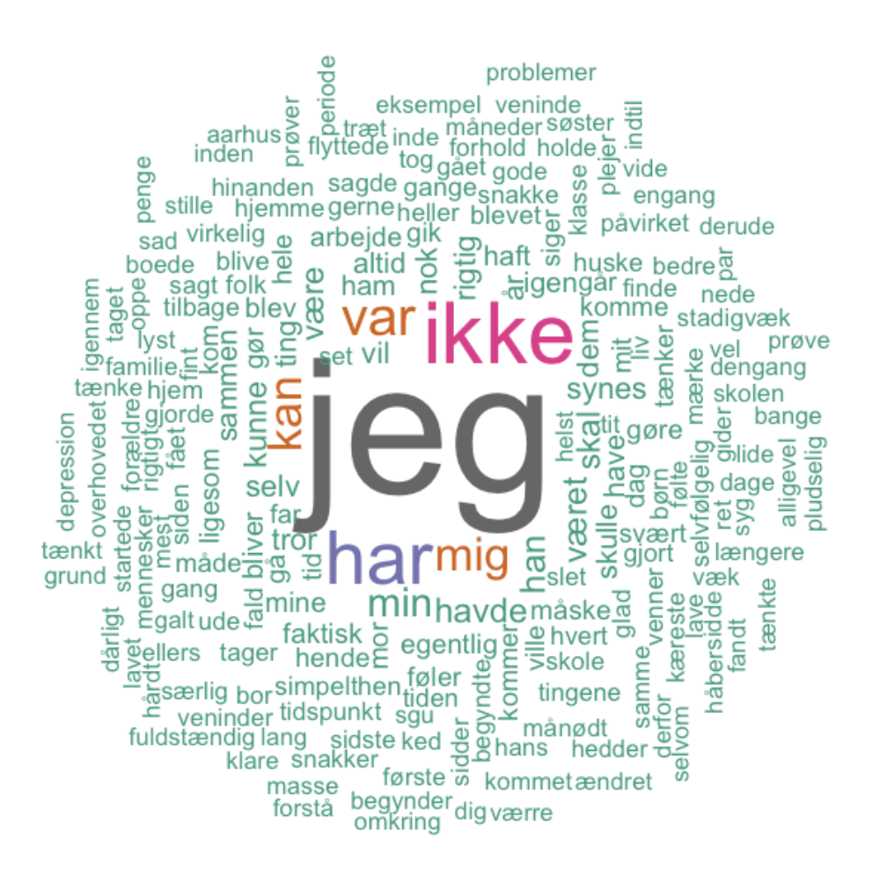

# 🗣️ Can Linguistic Patterns Identify and Classify Depression?
### Depression Detection through Various Linguistic Features in Danish

Programming language: *R*. 

An examination of the linguistic patterns of Danish-speaking individuals suffering from Major Depressive Disorder, by comparing with healthy controls, in the context of an autobiographical interview. 

**Results** 
We found, how individuals suffering from MDD used significantly more pronouns compared to controls, a significant difference in average sentiment scores between the groups, and a tendency of depressed using shorter words. Topic modeling did not reveal any significant information. The topics did not reveal any eloquent structure of the data. One reason could be the framework given in the experiment. 

A Naïve Bayes model achieved a F1-score of 0.73 and a sensitivity and specificity score of 0.67 and 0.83 respectively, when detecting depression based on linguistic features.
A SVM model achieved a F1-score of 0.62, and a sensitivity of only 0.50 and a specificity of 0.90.
Additionally, the Naïve Bayes and SVM achieved fairly high positive predictive values of 0.80 and 0.83. However, the Naïve Bayes classifier did present a higher negative predictive value of 0.71 than the SVM of just 0.64. 

 
The file called "Depression" include feature extraction, cross-validation, models, plots & classifiers. The file called "TopicModelling" include topic modelling. 

____

> For any questions or inquiries, feel free to reach out at abseeberg@clin.au.dk or through LinkedIn 

